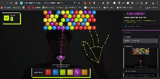

  <h1>🎯 Bilal's Slingshot 🎯</h1>
  
  <p><strong>A Next-Gen AI-Powered Webcam Bubble Shooter!</strong></p>

  <h3>🎮 <a href="https://bilals-slingshot-352425888965.us-central1.run.app/">PLAY LIVE DEMO HERE</a> 🎮</h3>

  

  <p>
    
    
    
    
  </p>
</div>

---

## 🤯 What is this?

**Bilal's Slingshot** is not your average bubble shooter. By combining **Google's MediaPipe Hand Tracking** with the insane reasoning speed of **Gemini 3 Flash**, your physical hands become the controller, and an AI co-pilot actively watches the board to give you real-time strategic advice!

No keyboard. No mouse. Just **Pinch, Drag, and Shoot** with your actual hands in front of your webcam.

## ✨ Epic Features

- **👐 Real-Time Hand Tracking:** Full physical control over the slingshot tension, angle, and firing mechanism using your webcam.
- **🧠 Gemini AI Tactical Co-Pilot:** The game takes a snapshot of your board and sends it to `gemini-3-flash`. The AI analyzes the board, predicts the best combos, and literally tells you where to shoot!
- **🟢 Retro Neon Brutalism:** A stunning, high-contrast arcade aesthetic that feels premium and nostalgic.
- **🚀 Ultra-Optimized:** Built on Vite + React. Game logic runs cleanly without lag, even while the AI processes vision in the background.

---

## 🛠️ How to Run Locally

You can get this game running on your own machine in less than 2 minutes!

**Prerequisites:** Node.js v18+

1. **Clone the repository**
   ```bash
   git clone https://github.com/Bilal-Junaid-Jiwani/Slingshot.git
   cd Slingshot
   ```

2. **Install Dependencies**
   ```bash
   npm install
   ```

3. **Get your Gemini API Key**
   - Go to [Google AI Studio](https://aistudio.google.com/) and grab an API Key.
   - Create a file named `.env.local` in the root folder.
   - Add your key like this:
     ```env
     GEMINI_API_KEY=your_api_key_here
     ```

4. **Launch the Game!**
   ```bash
   npm run dev
   ```
   *Note: Open the game on a desktop or laptop. Hand-tracking requires a wider screen!*

---

## ☁️ Deploy to Google Cloud Run

Want to host it yourself? The project includes a multi-stage `Dockerfile` and `nginx.conf` ready for production.

```bash
# Authenticate with Google Cloud
gcloud auth application-default login

# Deploy directly via source
gcloud run deploy bilals-slingshot --source . --region us-central1 --allow-unauthenticated
```

---

## 🤝 Contributing

Got ideas to make this even crazier? Boss fights? Dual-wielding hands? Custom power-ups? 
Pull requests are 100% welcome! Fork the repo, make your changes, and hit me up.

<br/>

<div align="center">
  <i>Created with ❤️ by <b>Bilal</b></i>
</div>
